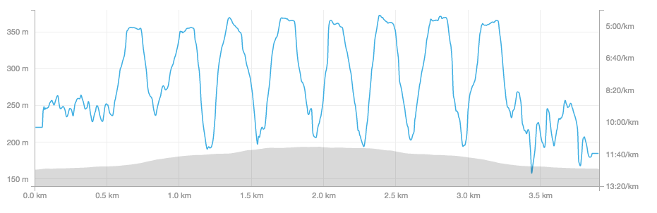

#### Week 2 Day 1

* 6x 90 second run/90 second walk
* Went in the afternoon
* Average pace: 7:10/km
* Not too difficult
* Temperature: 22°C
* Humidity: 68%

#### Week 1 Day 3

* 8x 60 second run/90 second walk
* Went earlier than usual
* Average pace: 7:58/km
* Not quite as easy as W1D3 but not particularly difficult
* Ate within energy deficit on day before
* Temperature: 16°C
* Humidity: 70%

#### Week 1 Day 2

* 8x 60 second run/90 second walk
* Average pace: 7:49/km
* I was actually hoping the average pace would be _slower_ not faster. I want to keep a low pace right now and focus on endurance
* This run was _much_ easier than W1D1
* Was far more caffeinated than W1D1
* Ate around energy balance on day before
* Temperature: 14°C
* Humidity: 68%

#### Week 1 Day 1

* 8x 60 second run/90 second walk
* Average pace: 7:55/km
* Very challenging, hardly finished each interval
* Ate within energy deficit on day before
* Temperature: 26°C
* Humidity: 73%
