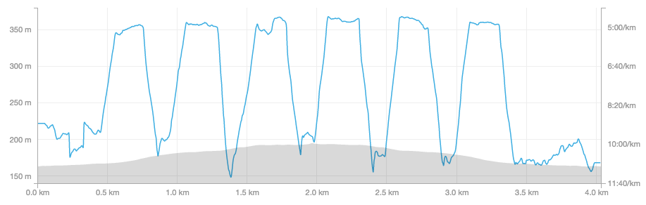
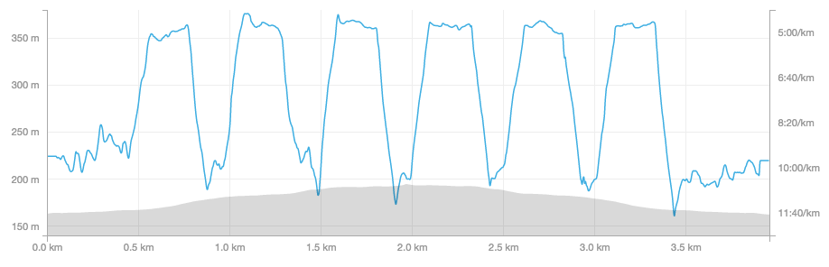
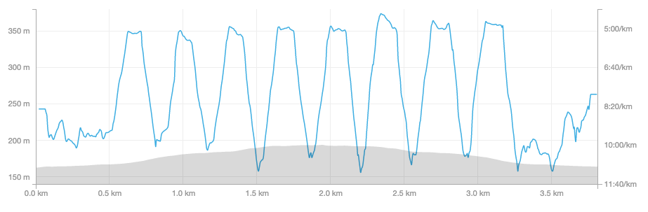

#### Week 3 Day 1

* 2x 90 second run/90 second walk/3 minute run/3 minute walk
* Went at 12:30PM
* Fairly difficult, just barely made the three minute springs
* Was feeling sorta shakey before going
* Temperature: 18°C
* Humidity: 92%

#### Week 2 Day 3

* 6x 90 second run/90 second walk
* Went at 2PM
* Average pace: 7:43/km
* Not too difficult
* Hadn’t eaten much before
* Temperature: 16°C
* Humidity: 79%

#### Week 2 Bonus Run

* Average pace: 7:54/km

#### Week 2 Day 2

* 6x 90 second run/90 second walk
* Went around noon
* Average pace: 7:33/km
* Not too difficult, about the same as last time
* Hadn’t eaten much before
* Rained on
* Temperature: 17°C
* Humidity: 71%

#### Week 2 Day 1

* 6x 90 second run/90 second walk
* Went in the afternoon
* Average pace: 7:10/km
* Not too difficult
* Temperature: 22°C
* Humidity: 68%

#### Week 1 Day 3

* 8x 60 second run/90 second walk
* Went earlier than usual
* Average pace: 7:58/km
* Not quite as easy as W1D3 but not particularly difficult
* Ate within energy deficit on day before
* Temperature: 16°C
* Humidity: 70%

#### Week 1 Day 2

* 8x 60 second run/90 second walk
* Average pace: 7:49/km
* I was actually hoping the average pace would be _slower_ not faster. I want to keep a low pace right now and focus on endurance
* This run was _much_ easier than W1D1
* Was far more caffeinated than W1D1
* Ate around energy balance on day before
* Temperature: 14°C
* Humidity: 68%

#### Week 1 Day 1

* 8x 60 second run/90 second walk
* Average pace: 7:55/km
* Very challenging, hardly finished each interval
* Ate within energy deficit on day before
* Temperature: 26°C
* Humidity: 73%
